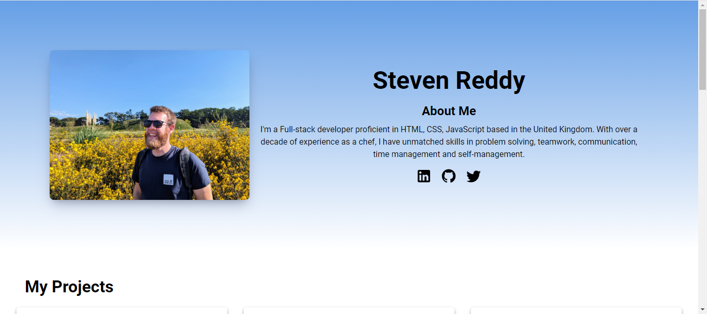
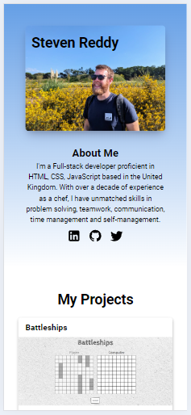
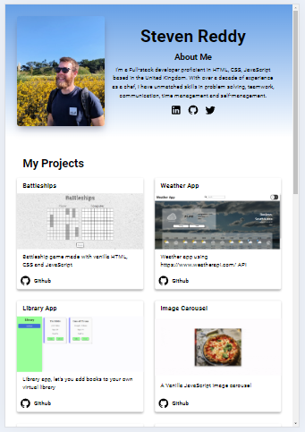

# Homepage - The Odin Project

## Objective:

Create a responsive webpage that seamlessly adapts to different screen sizes. This project provides an excellent opportunity to apply newly acquired skills in `<source>`, `@media`, and responsive design principles.

## Model:

### Index
|  Desktop    | Tablet    | Mobile    |
|-------------|-----------|-----------|
| |||

## Project Highlights:

* **Responsive Design:** Leveraged CSS Grid to dynamically adjust the number of cards displayed based on screen size.
* **Enhanced Aesthetics:** Incorporated SVGs for a more professional and visually appealing presentation.
* **Interactive Elements:** Implemented `@keyframes` to animate the title when hovering over the SVG.
* **Efficient Project Management:** Used JavaScript to dynamically generate project cards from an array, simplifying future additions.
* **Smooth User Experience:** Employed `setTimeout` and `transition` to gradually display project cards, avoiding abrupt loading.

## Challenges Overcome:

* **Transition Effects:** Successfully applied `transition` to achieve a smooth fade-in effect for project cards.
* **Responsive Images:** Implemented `<source>` and `<picture>` elements to display appropriate images based on screen width.
* **SVG Integration:** Utilized `createElementNS` and `setAttributes` to dynamically create and add SVG elements via JavaScript.

## New Skills Acquired:

* **Asynchronous Operations:** Combined `setTimeout` with `transition` to create a more engaging user experience.
* **Responsive Image Handling:** Mastered the use of `<source>` and `<picture>` for adaptive image display.
* **SVG Manipulation:** Gained proficiency in creating and manipulating SVG elements using JavaScript.

## Technologies Used:

* HTML
* CSS
* JavaScript